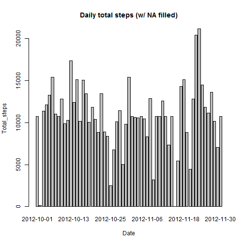

# Reproducible Research: Peer Assessment 1  
Load needed libraries:

```r
library(data.table); library(plyr); library(lattice)
```
## Loading and preprocessing the data
### Load the data:  

```r
data <- read.csv(unz("activity.zip", "activity.csv"))
# remove NA
d_rmNA <- data.table(data[!is.na(data$steps),])
```
### Produce data of steps by date/interval (NA removed):  

```r
# Split by date then sum the steps
spl_d <- (with(d_rmNA, split(steps, date)))
date <- labels(spl_d)
sum_d <- with(d_rmNA, lapply(spl_d, sum))
steps_by_date <- data.table("date"=date, "total_steps"=sum_d)

# Split by each interval then sum the steps
spl_i <- with(d_rmNA, split(steps, interval))
interval <- as.numeric(labels(spl_i))
mean_i <- with(d_rmNA, lapply(spl_i, mean))
steps_by_interval <- data.table("interval"=interval, "mean_steps"=mean_i)
```
## What is mean total number of steps taken per day?  
### Plot: total steps taken each day  

```r
barplot(unlist(sum_d), xlab="Date", ylab="Total_steps", main="Daily total steps (w/o NA)")
```

 
  
### Mean total number of steps taken per day:  

```r
mean(unlist(steps_by_date$total_steps))
```

```
## [1] 9354
```
### Median total number of steps taken per day:  

```r
median(unlist(steps_by_date$total_steps))
```

```
## [1] 10395
```
## What is the average daily activity pattern?  
### Time series plot of mean daily activity pattern:  

```r
with(steps_by_interval, plot(interval, mean_steps, type="l", main="Mean activity pattern (w/o NA)"))
```

 
### The interval with the maximum number of steps:  

```r
steps_by_interval[which(steps_by_interval$mean_steps==max(unlist(steps_by_interval$mean_steps)))]
```

```
##    interval       mean_steps
## 1:      835 206.169811320755
```
## Imputing missing values
### The total number of missing values in the dataset:  

```r
sum(is.na(data$steps))
```

```
## [1] 2304
```
### Fill in the missing values:  
The missing values NA will be all replaced simply by average steps in each interval.

```r
# Create new dataframe
d_fiNA <- data.frame(data)
# Replace NA by mean steps of each interval
d_fiNA[is.na(data$steps), 1] <- rep(unlist(steps_by_interval[[2]]), 8)
# Process the data
spl_d_fiNA <- (with(d_fiNA, split(steps, date)))
date_fiNA <- labels(spl_d_fiNA)
sum_df <- with(d_fiNA, lapply(spl_d_fiNA, sum))
steps_by_date_fiNA <- data.table("date"=date_fiNA, "total_steps"=sum_df)
```
### Plot: total steps taken each day  

```r
barplot(unlist(sum_df), xlab="Date", ylab="Total_steps", main="Daily total steps (w/ NA filled)")
```

 
  
### Mean total number of steps taken per day:  

```r
mean(unlist(steps_by_date_fiNA$total_steps))
```

```
## [1] 10766
```
### Median total number of steps taken per day:  

```r
median(unlist(steps_by_date_fiNA$total_steps))
```

```
## [1] 10766
```
## Are there differences in activity patterns between weekdays and weekends?  
### Create new factor with 2 levels: "weekday" & "weekend" in dataset d_fiNA:  

```r
# Set the system weekdays displayed in English:
Sys.setlocale(category = "LC_TIME", locale = "English")
```

```
## [1] "English_United States.1252"
```

```r
# Add a variable in 2 levels of weekend/weekday:
weekdays <- format(as.Date(d_fiNA$date, "%Y-%m-%d"), "%w")
weekdays <- gsub("0|6", "weekend", weekdays)
weekdays <- gsub("[1-5]", "weekday", weekdays)
weekdays <- as.factor(weekdays)
```
### Process the data table:  

```r
# Add weekdays to data table
d_fiNA <- data.table(d_fiNA)
d_fiNA[,weekdays:=weekdays]
```

```
##          steps       date interval weekdays
##     1: 1.71698 2012-10-01        0  weekday
##     2: 0.33962 2012-10-01        5  weekday
##     3: 0.13208 2012-10-01       10  weekday
##     4: 0.15094 2012-10-01       15  weekday
##     5: 0.07547 2012-10-01       20  weekday
##    ---                                     
## 17564: 4.69811 2012-11-30     2335  weekday
## 17565: 3.30189 2012-11-30     2340  weekday
## 17566: 0.64151 2012-11-30     2345  weekday
## 17567: 0.22642 2012-11-30     2350  weekday
## 17568: 1.07547 2012-11-30     2355  weekday
```

```r
# Split by weekdays
d_wd <- d_fiNA[weekdays=="weekday"]
d_we <- d_fiNA[weekdays=="weekend"]
# Calculate mean steps by interval, in 2 levels weekday/weekend
t1 <- data.table("interval"=as.numeric(labels(spl_i)), "num_steps"=tapply(d_wd$steps, d_wd$interval, mean), "weekdays"="weekday")
t2 <- data.table("interval"=as.numeric(labels(spl_i)), "num_steps"=tapply(d_we$steps, d_we$interval, mean), "weekdays"="weekend")
# Integrate weekday/weekend table
t <- rbind(t1, t2)
t$weekdays <- as.factor(t$weekdays)
```
### Time series plot with 2 panels weekday/weekend:  

```r
with(t, xyplot(num_steps ~ interval | weekdays, layout = c(1,2), type="l"))
```

 
